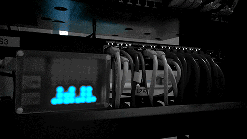

# silicorn
## Draw histograms on Pimoroni's [Unicorn HAT] with colorful approach to temporal resolution

__Silicorn__ takes in values from __0 to 100__ from stdin and draws on the HAT.
It will remember the last 128 values, average them and change color according to a built-in heatmap `(heatmap.c)`.

### Pics or it didn't happen
_HAT-o-graming_ modest CPU utilization from a Catalyst switch:  


CPU is too damn high!  


This is what __silicorn__ expects from you as input:
```bash
pi@raspberrypi $ while :; do shuf -i 1-100 -n1 ; sleep 0.6 ; done
46
83
0
14
```
One value per line, terminated by `\n` (end-of-line).

Float is good too, so:
```
12.023
0
0.12
100.0
```
will all get you some LED action.

`0` (zero) is represented one _pixel_ high. Otherwise you wouldn't know the difference between __silicorn__ not running anymore or your input just feeding in zeros. That being said, __silicorn__ doesn't break.

Alright alright, if you fuzzy it really hard it will probably shit rainbows from all I/Os. Try it.

### Adjust brightness (optional)
Edit `hat.c`:
```c
#define BRIGHTNESS      6 /* 0-255 */`
```

### Enable DEBUG output (optional)
Edit `debug.h`:
```c
#define DEBUG 1
```

### Build
```bash
git clone https://github.com/snobu/silicorn
cd silicorn
sudo make
```

### Test Run
```bash
sudo `while :; do shuf -i 1-100 -n1 ; sleep 0.6 ; done | ./silicorn`
```
  
  
   
>###*Alright, what do i do with this thing?*

### Read CPU utilization over SNMP and plot every 5 seconds

__pollsnmp.sh:__

```bash
#!/usr/bin/env bash

SILICORN=/tmp/silicorn/silicorn
SNMP_COMMUNITY=public
SLEEP_BETWEEN_POLLS=5 #seconds

while :
do
    snmpwalk -Oqv -v2c -c $SNMP_COMMUNITY $1 .1.3.6.1.4.1.9.2.1.56
    sleep $SLEEP_BETWEEN_POLLS
done | $SILICORN
````

```bash
pi@raspberrypi $ chmod +x pollsnmp.sh
pi@raspberrypi $ sudo ./pollsnmp.sh 10.1.1.1
```

                 10.1.1.1 = Cisco box
    .1.3.6.1.4.1.9.2.1.56 = SNMP MIB for CPU utilization over the last five seconds
[How to Collect CPU Utilization on Cisco IOS Devices Using SNMP]


### Plot NASDAQ real time price for MSFT

```bash
pi@raspberrypi $ wget -qO- "http://finance.yahoo.com/d/quotes.csv?s=MSFT&f=snl1"
"MSFT","Microsoft Corporation",42.905

pi@raspberrypi $ wget -qO- "http://finance.yahoo.com/d/quotes.csv?s=MSFT&f=snl1" | awk -F, '{print $3}'
42.905
```

__nasdaq.sh:__
```bash
#!/usr/bin/env bash

while :
do
    wget -qO- "http://finance.yahoo.com/d/quotes.csv?s=MSFT&f=snl1" |
        awk -F, '{print $3}'
    sleep 60
done | ./silicorn
```

```bash
pi@raspberrypi $ chmod +x nasdaq.sh
pi@raspberrypi $ sudo ./nasdaq.sh
```

[Unicorn HAT]: http://shop.pimoroni.com/products/unicorn-hat

[How to Collect CPU Utilization on Cisco IOS Devices Using SNMP]: http://www.cisco.com/c/en/us/support/docs/ip/simple-network-management-protocol-snmp/15215-collect-cpu-util-snmp.html
