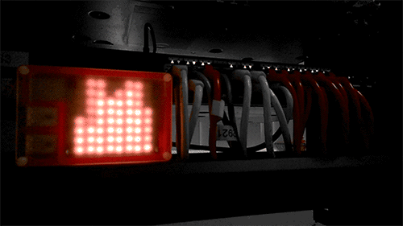

# silicorn
Draw histograms on Pimoroni's [Unicorn HAT] with interesting approach to
temporal resolution

### Pics or it didn't happen

### Build
    sudo ./make

### Run
    sudo seq 100 | ./silicorn

[Unicorn HAT]: http://shop.pimoroni.com/products/unicorn-hat

